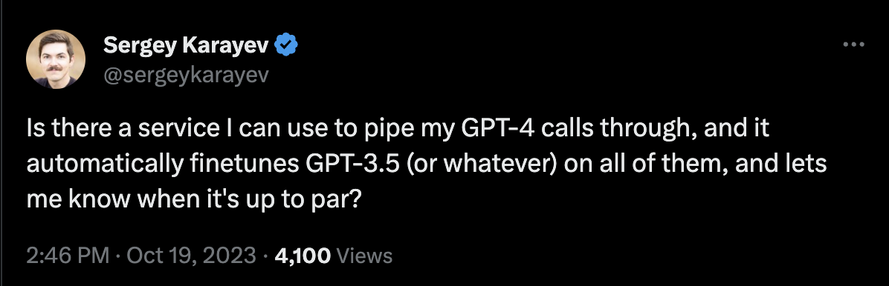
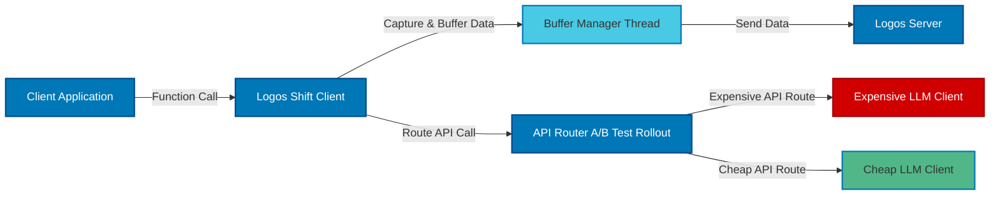

---

# Logos Shift

**Train and Shift your Logos Brain (LLM)**

Integrating Large Language Models (LLMs) into production systems can be a convoluted process, with myriad challenges to overcome. While several tools offer call instrumentation, **Logos Shift** sets itself apart with its game-changing feature: **automated rollout of your fine-tuned model**. Just integrate with a single line of code and let us notify you when your fine-tuned model is ready for deployment.

You can also do this yourself for free. LogosShift is the simplest and best way to do this for hackers.


## Key Feature

- **Effortless A/B Rollout**: Once your fine-tuned model achieves readiness, it's rolled out as an A/B test. No manual intervention, no complex configurations. Just simplicity.

## Other Features

- **No Proxying**: Direct calls, eliminating the latency of proxying.
- **Retain Your OpenAI Key**: Your OpenAI key remains yours, safeguarding confidentiality. No leaked keys.
- **Feedback-Driven Finetuning**: Refine model performance with feedback based on unique result IDs.
- **Open Source**: Flexibility to modify and adapt as needed.
- **Dynamic Configuration**: Synchronize with server configurations on-the-fly.
- **Upcoming**:
    - Error fallback mechanisms

## Why



At [Bohita](https://bohita.com), our pioneering efforts in deploying Large Language Models (LLMs) in production environments have brought forth unique challenges, especially concerning cost management, latency reduction, and optimization. The solutions available in the market weren't adequate for our needs, prompting us to develop and subsequently open-source some of our bespoke tools.

On the subject of proxying: We prioritize the reliability and uptime of our services. By introducing an additional domain as a dependency, we'd inherently be reducing our uptime. Specifically, the probability of combined uptime would be \(1 - (P_A\_up\_B\_down + P_B\_up\_A\_down + P_both\_down)\), which is inherently less than the uptime of either individual service. Given the inherent unpredictability of APIs in today's landscape, compromising our reliability in this manner is not a trade-off we're willing to make.

## Getting Started

### Prerequisites

- Obtain an API key from [Bohita Logos Shift Portal](https://bohita.com).

### Installation

```bash
pip install logos_shift_client
```

### Basic Usage

```python
from logos_shift_client import LogosShift

# Initialize with your API key
logos_shift = LogosShift(api_key="YOUR_API_KEY")

# Instrument your function
@logos_shift()
def add(x, y):
    return x + y

result = add(1, 2)

# Optionally, provide feedback
logos_shift.provide_feedback(result['bohita_logos_shift_id_123', "success")
```

## How It Works

Here's a high-level overview:



## Dataset

All function calls are grouped into datasets. Think of this as the usecase those calls are made for.
If you are intrumentating just one call, then you don't need to do anything. The default dataset is 'default'.

If you have different usecases in your application (E.g, chatbot for sales, vs chatbot for help), you should separate them out.

```python
@logos_shift(dataset="sales")
def add_sales(x, y):
    return x + y

@logos_shift(dataset="help")
def add_help(x, y):
    return x + y
```

This helps you track them separately and also finetune them separately for each use case.

## Metadata

You can provide additional metadata, including `user_id`, which can be used for routing decisions based on user-specific details.

```python
@logos_shift()
def multiply(x, y, logos_shift_metadata={"user_id": "12345"}):
    return x * y
```

## Feedback

Using feedback you can get better models that will be cheaper and more effective.

If you don't have feedback, it will be auto-regressive as usual.

## Configuration Retrieval

The library will also support retrieving configurations every few minutes, ensuring your logos_shift adapts to dynamic environments.

## Contribute

Feel free to fork, open issues, and submit PRs. For major changes, please open an issue first to discuss what you'd like to change.

## License

This project is licensed under the MIT License.
