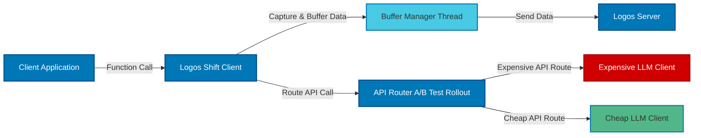

---

# Logos Shift

Logos Shift is an open-source library designed to instrument your calls without adding latency. Integrate it with your existing systems, and gain insights into the function's input, output, and associated metadata.

This is designed to switch your expensive model with a fine tuned model

## Features

- **No Proxying**: Direct calls without the overhead of proxying, ensuring no additional latency.
- **Keep Your OpenAI Key**: We don't need access to your OpenAI key. Ensure it stays confidential and with you.
- **Feedback Support**: Provide feedback on whether a result was successful or not based on its unique ID. This is used to finetune your model.
- **Truly Open Source**: Extend and modify as per your requirements.
- **Upcoming Features**:
  - Dynamic configuration from the server.

## Why


## Getting Started

### Prerequisites

- Obtain an API key from [Bohita Logos Shift Portal](https://bohita.com).

### Installation

```bash
pip install logos_shift_client
```

### Basic Usage

```python
from logos_shift_client import Instrumentation

# Initialize with your API key
instrumentation = Instrumentation(api_key="YOUR_API_KEY")

# Instrument your function
@instrumentation()
def add(x, y):
    return x + y

result = add(1, 2)

# Later, optionally, provide feedback
instrumentation.provide_feedback(result['bohita_logos_shift_id', "success")
```

## How It Works

Here's a high-level overview:




## Metadata

You can provide additional metadata, including `user_id`, which can be used for routing decisions based on user-specific details.

```python
@instrumentation()
def multiply(x, y, logos_shift_metadata={"user_id": "12345"}):
    return x * y
```

## Feedback

Logos Shift will soon support a feature where you can provide feedback on whether a result was successful or not based on its ID for finetuning. Stay tuned!

## Configuration Retrieval

The library will also support retrieving configurations every `n` minutes, ensuring your instrumentation adapts to dynamic environments.

## Contribute

Feel free to fork, open issues, and submit PRs. For major changes, please open an issue first to discuss what you'd like to change.

## License

This project is licensed under the MIT License.
